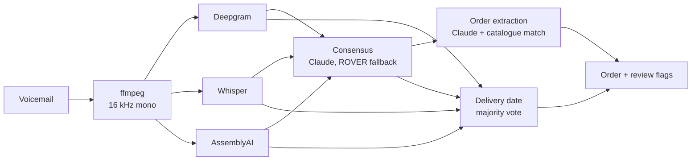

# 🎙️ Voice to Order

      

> Turn customer voicemails into structured orders using several speech-to-text providers and an LLM consensus step.

## 🎯 Why this project

Voicemail orders are noisy. Accents, product codes and background sound all cause transcription
errors, and different engines make different mistakes. This pipeline sends each message to
several providers in parallel and reconciles their transcripts with Claude. It then extracts the
customer, order lines and delivery date, and flags the order for a human whenever it isn't sure.

## ⚙️ How it works



1. **Ingest:** check the file's type, size and duration, then convert it to 16 kHz mono with ffmpeg.
2. **Transcribe in parallel:** Deepgram, Whisper and AssemblyAI, each biased towards catalogue
   product names. Every provider has its own timeout, and one failure doesn't lose the voicemail.
3. **Reconcile:** Claude merges the transcripts word by word and reports spans it is unsure of.
   If the LLM is unavailable, ROVER word voting takes over.
4. **Extract:** Claude returns customer, lines and notes as structured output. Each line is
   fuzzy-matched to a catalogue SKU.
5. **Vote on the date:** every transcript is parsed for the delivery date on its own ("next
   Monday", "the 14th", "Tuesday the 13th of October") and the majority wins.
6. **Flag, don't guess:** unmatched products, an unknown caller, uncertain words, disagreement on
   the date, or only one working provider all mark the order `needs_review`.

## 🚀 Quickstart

Requires Python 3.12+ and ffmpeg.

```bash
make install                 # creates .venv and installs the package with dev tools
cp .env.example .env         # add the API keys you have; providers without a key are skipped
make check                   # ruff, mypy --strict, pytest
```

Keys can use the standard names (`ANTHROPIC_API_KEY`, `OPENAI_API_KEY`, `DEEPGRAM_API_KEY`,
`ASSEMBLYAI_API_KEY`) or the `VTO_` versions. At least one speech-to-text key is required, plus
Anthropic credentials for consensus and extraction.

### Run locally

The pipeline can run with free local models, alone or beside the cloud providers.

```bash
pip install -e '.[local]'           # faster-whisper for in-process speech-to-text
ollama pull qwen2.5:14b-instruct    # any OpenAI-compatible server works for the LLM
```

```bash
VTO_TRANSCRIPTION_PROVIDERS=whisper-local       # add it to the list to compare with cloud providers
VTO_LLM_PROVIDER=openai_compatible
VTO_LLM_BASE_URL=http://localhost:11434/v1      # Ollama's default
VTO_LLM_MODEL=qwen2.5:14b-instruct
```

- `whisper-local` needs no API key. The model (`VTO_LOCAL_WHISPER_MODEL`, default `small`) is
  downloaded from the Hugging Face hub on first use. It has its own timeout
  (`VTO_LOCAL_WHISPER_TIMEOUT_SECONDS`, default 300) because CPU inference and that first download
  can outlast the cloud timeout.
- The LLM client asks for JSON-schema constrained output and, if the server rejects
  `response_format`, retries with the schema in the prompt. Smaller models make more extraction
  mistakes than Claude, so check `needs_review` and run `voice-to-order evaluate` before trusting
  them.
- With a single provider the consensus step has nothing to compare, so orders are flagged for
  review; list several providers to get real consensus.
- The extra pins `av<17` because faster-whisper 1.2.x breaks with av 19.

### Command line

```bash
voice-to-order process path/to/voicemail.m4a --caller "+44 7700 900123"   # one file → order JSON
voice-to-order evaluate                                      # accuracy on hand-written transcripts
voice-to-order record                                        # save real provider output for samples
voice-to-order evaluate --transcripts recorded --orders      # real transcripts + order accuracy
```

### HTTP API

```bash
make run    # uvicorn on http://localhost:8000, docs at /docs
```

Or with Docker (ffmpeg included):

```bash
docker build -t voice-to-order .
docker run -p 8000:8000 --env-file .env voice-to-order
```

| Method | Path | Description |
|---|---|---|
| `GET` | `/health` | Liveness |
| `POST` | `/voicemails` | Multipart `file`, plus optional `caller_number` and `received_at`. Returns `202` with a `job_id` |
| `GET` | `/jobs/{id}` | Job status and the full pipeline result (every transcript, consensus, order) |
| `GET` | `/jobs/{id}/order` | The order. `409` while running, `422` if the job failed |

## 📊 Evaluation

`samples/` has 8 synthetic labelled voicemails: a reference transcript, the expected order, and
phone-quality audio made with text-to-speech. WER is scored after number normalisation, so
"four" and "4" count as the same word.

**Real provider output** (`voice-to-order evaluate --transcripts recorded`):

| Source | WER | Mean CER | Delivery date accuracy |
|---|---:|---:|---:|
| Whisper (`whisper-1`) | 5.5% | 2.1% | 100% |

The remaining errors are the ones that matter for orders: "Harbour Kitchen" → "Haber kitchen",
"account 5120" → "a count 5120", "Marco at Piazza" → "Marco ad Piazza". Only Whisper has been
recorded so far. Run `voice-to-order record` with Deepgram and AssemblyAI keys to add them.
Text-to-speech audio is cleaner than a real voicemail, so treat these figures as an optimistic
baseline.

**Hand-written transcripts** with deliberate engine errors (`voice-to-order evaluate`). These show
how consensus and voting behave. They are **not** a measure of real provider accuracy:

| Source | WER | Delivery date accuracy |
|---|---:|---:|
| deepgram | 2.3% | 88% |
| assemblyai | 4.1% | 100% |
| whisper | 10.5% | 88% |
| ROVER consensus | 2.3% | 100% |
| **Date majority vote** | n/a | **100%** |

With only two engines, voting can't overrule a wrong one. The third provider is what lets the
vote fix both single-engine date errors ("Thursday" for Tuesday, "thirtieth" for 13th).

`--orders` adds order-level scoring: account and date accuracy, line precision and recall on
`(SKU, quantity)`, and the share of orders that are exactly right.

## 🧱 Project structure

```
src/voice_to_order/
├── audio/           ffmpeg wrapper and ingestion
├── transcription/   provider protocol, Deepgram / Whisper / AssemblyAI / replay, parallel runner
├── llm/             LLMClient protocol, Claude client, scripted fake for tests
├── consensus/       Claude reconciliation and ROVER word voting
├── extraction/      order extraction, catalogue matching, delivery date vote
├── evaluation/      WER/CER, provider and order accuracy, recorder
├── pipeline.py      runs one voicemail through every stage
├── api/ worker/     FastAPI app, asyncio worker pool and job store
└── cli.py
```

Each stage has a typed input and output, and vendors sit behind small protocols, so all 126 tests
run offline. See [docs/architecture.md](docs/architecture.md) for the design rules.

## 🗺️ Roadmap

- [x] Audio ingestion and conversion to MP3/WAV
- [x] Parallel transcription with multiple providers (Deepgram, Whisper, AssemblyAI)
- [x] Transcript consensus prompt (with ROVER fallback)
- [x] Order extraction from the final transcript
- [x] Majority vote for delivery dates
- [x] Accuracy comparison per provider, plus order-level accuracy
- [ ] Record Deepgram and AssemblyAI on the sample audio, and run `--orders` against Claude
- [ ] Evaluate on real (consented, anonymised) voicemails
- [ ] Persistent job store (Redis or Postgres) for multi-replica deployments

## 📌 Status

Working prototype. Every stage is implemented and tested, and CI runs lint, strict type checks
and tests on each PR. All data in this repository is synthetic.

---

Built by [Jahanzaib Ahmad](https://github.com/jehanxaibahmed) · Full Stack Engineer · AI & LLM Systems
