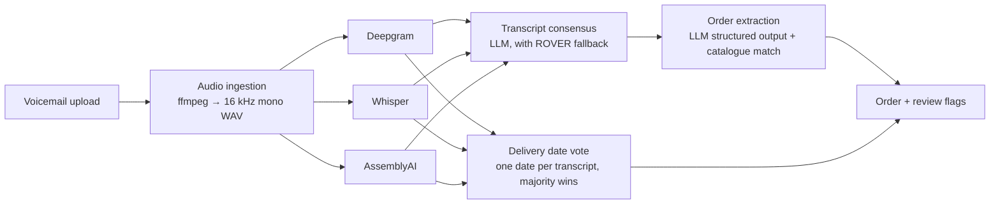

# Architecture

Voice to Order is a staged pipeline. Each stage has one job, a typed input and a typed output
(see `src/voice_to_order/domain/models.py`), and no knowledge of the stages around it. The
pipeline module wires them together, and the API and worker are thin layers on top.



## Layout

```
src/voice_to_order/
├── config.py            # Settings from VTO_* environment variables
├── domain/              # Pydantic models and the exception hierarchy
├── audio/               # ffprobe/ffmpeg wrappers and the ingestion service
├── transcription/       # Provider protocol, provider implementations, parallel runner
│   └── providers/
├── llm/                 # LLM client protocol, Claude client, scripted fake for tests
├── consensus/           # Transcript reconciliation (LLM + ROVER word voting)
├── extraction/          # Order extraction, catalogue matching, delivery date vote
├── evaluation/          # WER/CER, provider and order accuracy, recorder for real output
├── pipeline.py          # Orchestrates the stages for one voicemail
├── bootstrap.py         # Builds the production pipeline from settings
├── api/                 # FastAPI app
├── worker/              # Background job queue and job store
└── cli.py               # `voice-to-order` command
```

## Design rules

- **Ports and adapters.** Speech-to-text providers and the LLM sit behind small protocols
  (`TranscriptionProvider`, `LLMClient`). Business logic depends on the protocol, never on a
  vendor SDK, so every stage can be tested offline with fakes.
- **Partial failure is normal.** One provider timing out must not lose the voicemail. The runner
  returns successes and failures side by side; consensus works with whatever succeeded.
- **Flag, don't guess.** When providers disagree on the delivery date or an order line does not
  match the catalogue, the order is marked `needs_review` with a reason, rather than silently
  picking one.
- **Vote with independent signals.** The delivery date is parsed from each provider's
  transcript separately. Voting needs at least three engines to overrule one that is wrong.
- **Measure what matters.** WER is scored on number-normalised text, and order-level accuracy
  (SKU, quantity, account, date) is the headline metric.
- **Synthetic data only.** Everything in `samples/` is invented.
